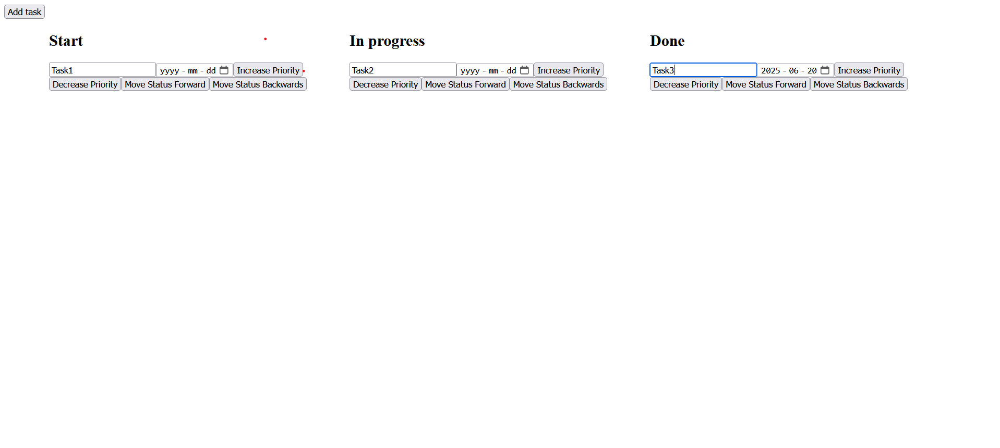

How to use the program: Clone repository (git clone https://github.com/Malmgrus/taskmanager) to directory of your choice.
Then open the console and change directory to that same map. Then type ng serve and open link to local-host.

All components are placed in App. The program uses dummyapi's generate random todo. It uses no other external libraries.

image of tasks in kanban format:
